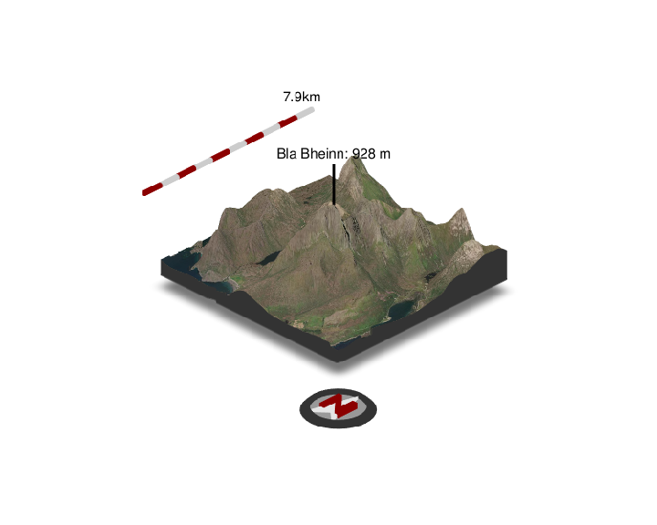
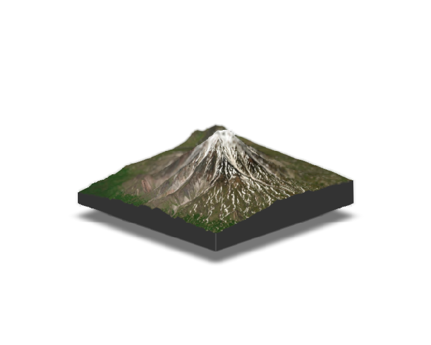

# rayvista

<p align="center">

</p>

## Introduction

**rayvista** is an R package providing a small plugin for the fabulous
[{rayshader}](https://github.com/tylermorganwall/rayshader) package. It
provides a single function `plot_3d_vista()` which allows the user to
create a 3D visualisation of any location on earth. It is reliant on two
other brilliant packages namely:
[{maptiles}](https://github.com/riatelab/maptiles) and
[{elevatr}](https://github.com/jhollist/elevatr). The many available map
tiles from {maptiles} can be easily overlaid on top of elevation data
from {elevatr} to create the 3D scene or vista :wink:

## Installation

``` r
# install.packages("devtools")
devtools::install_github("h-a-graham/rayvista")
```

## Examples

``` r
# Make sure to lod rayshader so you can interact with the {rgl} window after 
# running `plot_3d_vista()`
library(rayshader) 
library(rayvista)

plot_3d_vista(lat=57.219566, long=-6.092690,)

render_snapshot(clear=TRUE)
```

<!-- -->

``` r
plot_3d_vista(lat=55.757338, long=160.526712, phi=20)

render_snapshot(clear=TRUE)
```

<!-- -->

``` r
plot_3d_vista(lat=37.742501, long=-119.558298, zscale=5, zoom=0.5, theta=-65,
              phi=25)

render_snapshot(clear=TRUE)
```

<!-- -->
