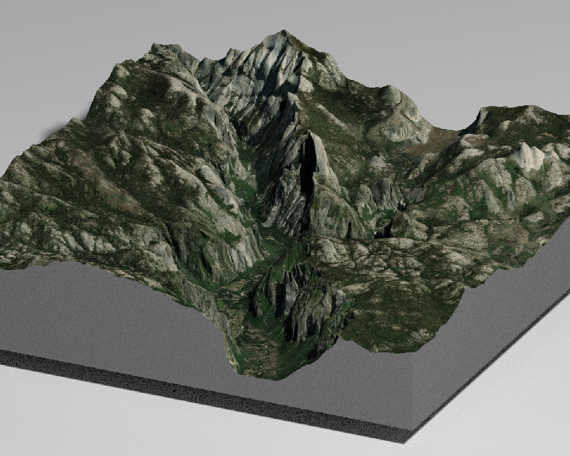

# rayshader

## Introduction

**rayvista** is a rayshader extension

## Installation

``` r
# install.packages("devtools")
devtools::install_github("h-a-graham/rayvista")
```

## Examples

``` r
# Make sure to so you can interact with the {rgl} window after running `plot_3d_vista()`
library(rayshader) 
library(rayvista)

plot_3d_vista(lat=55.757338, long=160.526712)

render_snapshot(clear=TRUE)
```

<!-- -->

``` r
plot_3d_vista(lat=37.742501, long=-119.558298, zscale=5)

render_snapshot(clear=TRUE)
```

<!-- -->
