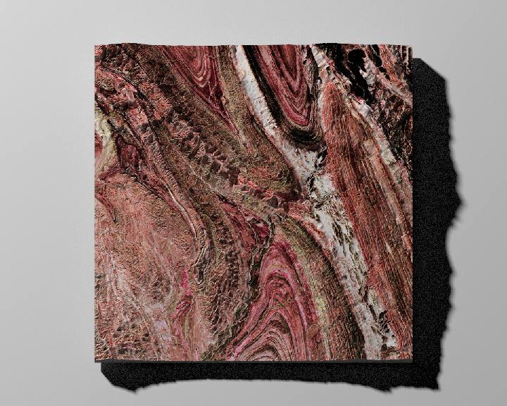
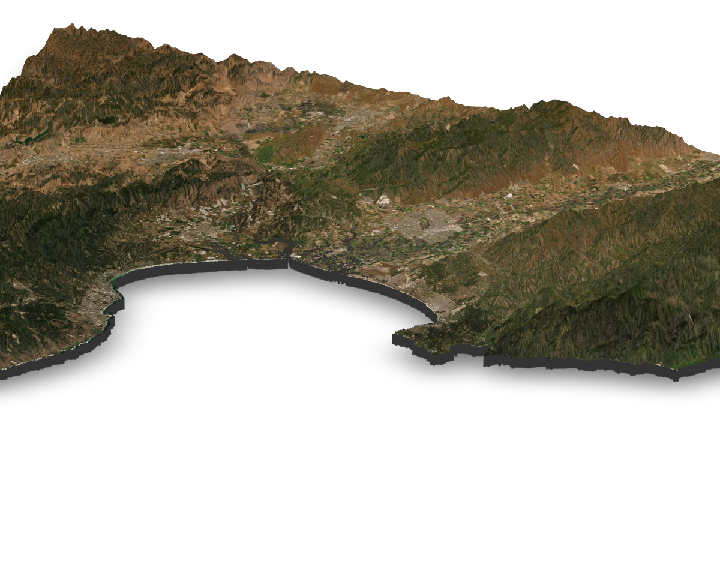
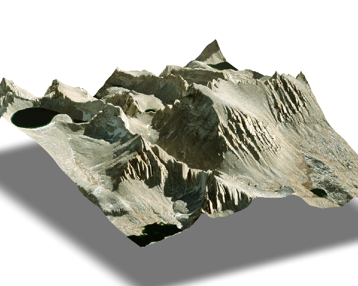

# rayvista

<p align="center">

</p>

## Introduction

**rayvista** is an R package providing a small plugin for the fabulous
[{rayshader}](https://github.com/tylermorganwall/rayshader) package. It
provides a single main function `plot_3d_vista` which allows the user to
create a 3D visualisation of any location on earth. It is reliant on two
other brilliant packages:
[{maptiles}](https://github.com/riatelab/maptiles) and
[{elevatr}](https://github.com/jhollist/elevatr). The many available map
styles from {maptiles} can be easily overlaid on top of elevation data
from {elevatr} to create the 3D scene or vista :wink:

An [{rgl}](https://github.com/cran/rgl) window is opened which displays
the vista and the user may then interact with it using a selection of
functions provided by {rayshader} including: `render_snapshot`,
`render_highquality`, `render_compass`, etc. see the [rayshader function
reference](https://www.rayshader.com/reference/index.html) for more
details…

You can access the data attribution from the returned matrix object.

This package is in its early days so there will no doubt be some issues.
Please feel free to submit an
[issue](https://github.com/h-a-graham/rayvista/issues) or start up a
[discussion]()

## Installation

``` r
# install.packages("devtools")
devtools::install_github("h-a-graham/rayvista", dependencies=TRUE)
```

## Examples

Make sure to load rayshader so you can interact with the {rgl} window
after running `plot_3d_vista()`! In this example we first create a scene
and then add additional features using the many rendering functions
available from
[{rayshader}](https://www.rayshader.com/reference/index.html#section-manipulate-and-capture-d-maps).
Don’t forget to use `?rayvista::plot_3d_vista` if you want more
information on the different avalable arguments.

``` r
library(rayshader) 
library(rayvista)

.lat <- 57.219566
.long <- -6.092690

cuillins <- plot_3d_vista(lat = .lat, long = .long, phi=30, outlier_filter=0.001)

render_label(heightmap= cuillins, text='Bla Bheinn: 928 m', lat = .lat,
             long=.long, extent = attr(cuillins, 'extent'),altitude=600,
             clear_previous = T, zscale = 2)

render_compass() 

render_scalebar(limits=c(
  round(dim(cuillins)[2]*attr(cuillins, 'resolution')/1000,1)),
  label_unit = 'km')

render_snapshot(clear=TRUE)
```

<!-- -->

Use
[`rayshader::render_depth`](https://www.rayshader.com/reference/render_depth.html)
to generate a lovely depth of field effect.

``` r
GoraBolshayaUdina <- plot_3d_vista(lat=55.757338, long=160.526712, zscale=4, phi=20)

render_depth(focus=0.4, focallength = 16, clear=TRUE)
```

<!-- -->

Here’s an example where we generate a render using
[`rayshader::render_highquality`](https://www.rayshader.com/reference/render_highquality.html).

``` r
Yosemite <- plot_3d_vista(lat=37.742501, long=-119.558298, zscale=5, zoom=0.5,
                          overlay_detail=14, theta=-65, windowsize =1200, 
                          phi=25)

render_highquality(lightdirection = 220, clear=TRUE)
```

<!-- -->

You can also use a range of different overlays from the {maptiles}
package. In this example we use the ‘img_provider’ argument and specify
‘OpenStreetMap’. Many other overlay maps are available - check out
`?maptiles::get_tiles` for more details.

``` r
HopkinsNZ <- plot_3d_vista(lat=-44.042238, long=169.860985, radius=5000, overlay_detail = 14,
             elevation_detail=13, zscale=5, img_provider = 'OpenStreetMap',
             cache_dir = 'testing',theta=25, phi=25, zoom=0.5,
             windowsize =1200, solid=T, background='grey10')

render_highquality(lightdirection = c(60,120, 240),
                   lightaltitude=c(90,25, 12),
                   lightintensity=c(100, 500, 450),
                   lightcolor = c("white", "#FF9956", "#FF79E7"),
                   clear=TRUE)
```

<!-- -->

Here we don’t show the vista - instead we retrieve the texture and
matrix by using the argument: ‘show_vista = F’. Then edit the colours
with [{magick}](https://docs.ropensci.org/magick/) before generating the
rgl window with `rayshader::plot_3d`.

``` r
# install.packages('magick')
library(magick)

sistan_suture<- plot_3d_vista(27.82153210664024, 60.5107976729012,radius=15000,
                              overlay_detail = 13, elevation_detail=10,
                              show_vista = FALSE)

# edit the texture using the {magick} package
temp_img <- tempfile(fileext = '.png')
png::writePNG(sistan_suture$texture, temp_img)
mag_img <- magick::image_read(temp_img)

edited_texture <- magick::image_modulate(mag_img, brightness = 90,
                                 saturation = 40, hue = 280) %>%
  magick::image_enhance() %>%
  magick::image_equalize() %>%
  magick::image_contrast(sharpen = 1)

magick::image_write(edited_texture, temp_img)
edit_tex <- png::readPNG(temp_img)

#plot directly with rayshader
rayshader::plot_3d(edit_tex, sistan_suture$dem_matrix, zscale=20,
                   windowsize = 1200, zoom=0.75, phi=80, theta=0)

render_highquality(lightaltitude = 40, clear=TRUE)
```

<!-- -->

This example makes use of the ‘req_area’ argument which allows the user
to supply an [{sf}](https://r-spatial.github.io/sf/) object (or
alternatively an sf readable file path) to request an an area which is
derived from the extent of the sf object.

``` r
monteray_ext <- attr(montereybay, 'extent')
monteray_area <- sf::st_bbox(c(xmin=monteray_ext[1],
                               ymin=monteray_ext[3],
                               xmax=monteray_ext[2],
                               ymax=monteray_ext[4])) %>%
  sf::st_as_sfc() %>%
  sf::st_sf(crs=attr(montereybay, 'crs'))

mray <- plot_3d_vista(req_area = monteray_area, phi=30, elevation_detail = 10,
                      overlay_detail = 11, zscale=20, elevation_src = 'gl3',
                      fill_holes=FALSE,theta = -70, zoom=0.4, windowsize=1200)
render_snapshot(clear=TRUE)
```

<!-- -->

It is also possible to provide your own elevation data, {rayvista} will
then automatically add an overlay to your data! This is done using the
‘dem’ argument; this can be either: a RasterLayer (generated with
[{raster}](https://rspatial.github.io/raster/reference/raster-package.html))
or SpatRaster (generated with
[{terra}](https://rspatial.github.io/terra/reference/terra-package.html))
or a file path that can be read by {raster}. Here is an example using
the awesome [{terrainr}](https://docs.ropensci.org/terrainr/) package!

``` r
# install.packages('terrainr')
library(terrainr)
library(sf)

mt_whitney_area <- data.frame(id = seq(1, 100, 1),
                              lat = runif(100, 36.564595, 36.599828),
                              lng = runif(100, -118.319322, -118.266924)) %>%
  st_as_sf(., coords = c("lng", "lat")) %>%
  st_set_crs(., 4326)

mw_tiles <- get_tiles(mt_whitney_area,
                      services = c("elevation"),
                      resolution = 5)

out <- plot_3d_vista(dem=mw_tiles$elevation, overlay_detail = 16, zscale=5,
                     windowsize=1200,zoom=0.5, theta=240, phi=25, solid=FALSE)

render_snapshot(clear=TRUE)
```

<!-- -->

In this example, we take full advantage of rayshader’s capabilities. We
use the `show_vista=F` argument in addition to the `overlay_alpha` which
sets the transparency of the overlay. Then we can use the returned
dem_matrix and texture values to build a shaded model with rayshader and
add the semi-transparent overlay.

``` r
lapalmaTF<- plot_3d_vista(lat=28.719946, long=-17.867091,radius=30000, 
                          overlay_detail=13, overlay_alpha = 0.6, 
                          elevation_detail=11, show_vista = F)

lapalmaTF$dem_matrix %>%
  height_shade()%>%
  add_shadow(ray_shade(lapalmaTF$dem_matrix, zscale=20), 0.2) %>%
  add_overlay(., lapalmaTF$texture,rescale_original=TRUE) %>%
  plot_3d(., lapalmaTF$dem_matrix, zscale=20,
          windowsize = 1200, zoom=0.25, phi=30, theta=45)

render_snapshot(clear=TRUE)
```

<!-- -->
